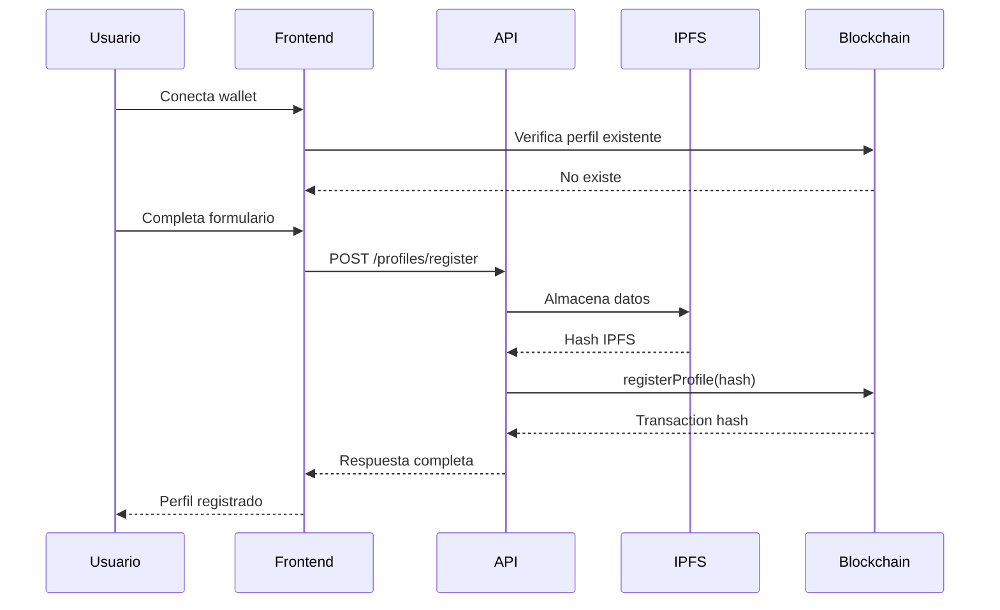
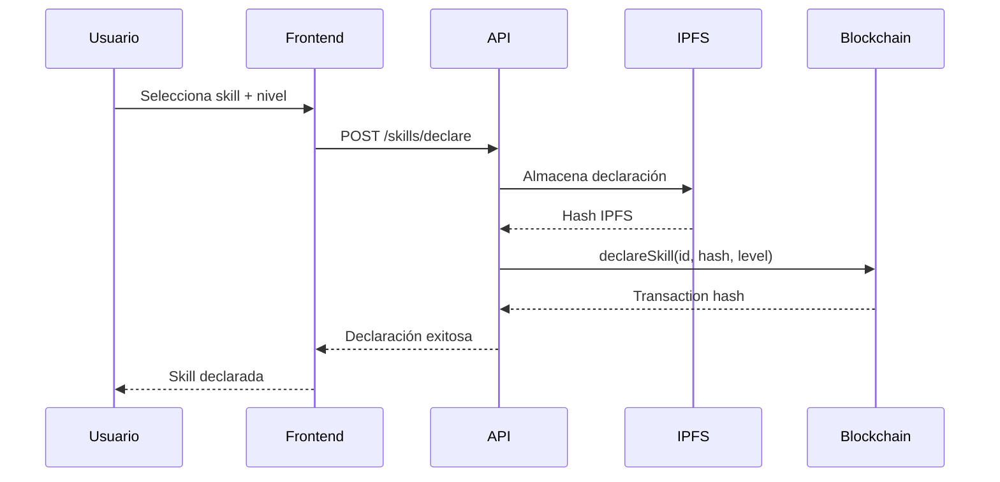
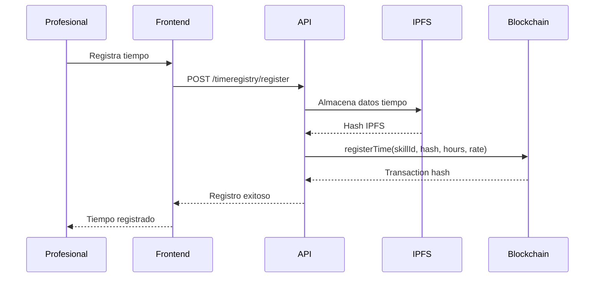

# 🏗️ Arquitectura Técnica - Musubi

## 📋 Visión General del Sistema

Musubi es una plataforma descentralizada que integra blockchain, IPFS y APIs para crear un ecosistema de intercambio de tiempo y habilidades. La arquitectura está diseñada para ser escalable, descentralizada y eficiente en costos de gas.

## 🔗 Componentes del Sistema

### 1. **Blockchain Layer (Ethereum/Hardhat)**
```
┌─────────────────────────────────────────────────────────────┐
│                    CONTRATOS INTELIGENTES                   │
├─────────────────────────────────────────────────────────────┤
│  KRMToken (ERC-20)     │  ProfileRegistry  │  SkillSystem  │
│  • Transferencias      │  • Gestión perfiles│  • Habilidades│
│  • Balance tracking    │  • IPFS hashes     │  • Validación │
├─────────────────────────────────────────────────────────────┤
│  TimeRegistry          │  P2PMarketplace    │  IPFSRegistry │
│  • Registro tiempo     │  • Servicios       │  • Hash store │
│  • Validación          │  • Órdenes         │  • Metadata   │
└─────────────────────────────────────────────────────────────┘
```

### 2. **Storage Layer (IPFS)**
```
┌─────────────────────────────────────────────────────────────┐
│                        IPFS NETWORK                         │
├─────────────────────────────────────────────────────────────┤
│  Perfiles              │  Habilidades       │  Tiempo       │
│  • Datos personales    │  • Metadatos       │  • Registros  │
│  • Ubicación           │  • Categorías      │  • Detalles   │
│  • Skills              │  • Niveles         │  • Empresas   │
└─────────────────────────────────────────────────────────────┘
```

### 3. **API Layer (Python/Flask)**
```
┌─────────────────────────────────────────────────────────────┐
│                        API SERVICES                         │
├─────────────────────────────────────────────────────────────┤
│  /profiles             │  /skills           │  /timeregistry│
│  • CRUD perfiles       │  • CRUD skills     │  • CRUD tiempo│
│  • IPFS integration    │  • IPFS integration│  • IPFS integ │
├─────────────────────────────────────────────────────────────┤
│  /marketplace          │  /krm              │  /users       │
│  • Servicios           │  • Token ops       │  • User mgmt  │
│  • Órdenes             │  • Balance         │  • Auth       │
└─────────────────────────────────────────────────────────────┘
```

### 4. **Frontend Layer (React/TypeScript)**
```
┌─────────────────────────────────────────────────────────────┐
│                      FRONTEND ARCHITECTURE                  │
├─────────────────────────────────────────────────────────────┤
│  Contexts               │  Hooks             │  Services    │
│  • Web3Context          │  • useContracts    │  • contracts │
│  • KRMContext           │  • useSkills       │  • ipfs      │
│  • NotificationContext  │  • useProfile      │  • api       │
├─────────────────────────────────────────────────────────────┤
│  Pages                  │  Components        │  Utils       │
│  • Dashboard            │  • Navbar          │  • blockchain│
│  • Skills               │  • Sidebar         │  • validation│
│  • TimeRegistry         │  • Forms           │  • helpers   │
└─────────────────────────────────────────────────────────────┘
```

## 🔄 Flujos de Datos

### 1. **Registro de Perfil**


### 2. **Declaración de Habilidades**


### 3. **Registro de Tiempo**


## 🏛️ Arquitectura de Contratos

### **KRMToken (ERC-20)**
```solidity
contract KRMToken is ERC20, AccessControl {
    bytes32 public constant KARMA_ROLE = keccak256("KARMA_ROLE");
    
    // Funcionalidades principales
    function mint(address to, uint256 amount) external onlyRole(KARMA_ROLE)
    function burn(uint256 amount) external
    function transfer(address to, uint256 amount) external override returns (bool)
}
```

### **ProfileRegistry**
```solidity
contract ProfileRegistry is AccessControl {
    struct Profile {
        string metadataURI;  // Hash IPFS
        uint256 profileType; // 0=Professional, 1=Company
        bool isActive;
        uint256 createdAt;
    }
    
    mapping(address => Profile) public profiles;
    
    function registerProfile(string calldata metadataURI, uint256 profileType) external
    function updateProfile(string calldata newMetadataURI) external
    function hasRegisteredProfile(address user) external view returns (bool)
}
```

### **SkillSystem**
```solidity
contract SkillSystem is AccessControl {
    struct Skill {
        uint256 id;
        string skillDataHash;  // Hash IPFS
        address creator;
        bool isActive;
        uint256 totalDeclarations;
        uint256 totalValidations;
    }
    
    struct DeclaredSkill {
        uint256 skillId;
        address professional;
        string declarationDataHash;  // Hash IPFS
        uint256 level;
        bool isActive;
        bool isValidated;
        address validatedBy;
    }
    
    function createSkill(string calldata skillDataHash) external
    function declareSkill(uint256 skillId, string calldata declarationDataHash, uint256 level) external
    function validateSkill(address professional, uint256 skillId, uint256 level) external
}
```

### **TimeRegistry**
```solidity
contract TimeRegistry is AccessControl {
    struct TimeEntry {
        uint256 id;
        address professional;
        uint256 skillId;
        string timeDataHash;  // Hash IPFS
        uint256 hoursWorked;
        uint256 hourlyRate;
        uint256 totalAmount;
        bool isValidated;
        address validatedBy;
    }
    
    function registerTime(uint256 skillId, string calldata timeDataHash, uint256 hoursWorked, uint256 hourlyRate) external
    function validateTimeEntry(uint256 entryId) external
    function getProfessionalEntries(address professional) external view returns (uint256[])
}
```

### **P2PMarketplace**
```solidity
contract P2PMarketplace is AccessControl {
    struct Service {
        uint256 id;
        string title;
        string description;
        address provider;
        uint256 pricePerHour;
        uint256[] skillIds;
        ServiceStatus status;
    }
    
    struct Order {
        uint256 id;
        uint256 serviceId;
        address client;
        address provider;
        uint256 hours;
        uint256 totalPrice;
        OrderStatus status;
    }
    
    function createService(string calldata title, string calldata description, uint256 pricePerHour, uint256[] calldata skillIds) external
    function createOrder(uint256 serviceId, uint256 hours, string calldata description) external
    function acceptOrder(uint256 orderId) external
    function completeOrder(uint256 orderId) external
}
```

### **IPFSRegistry**
```solidity
contract IPFSRegistry is AccessControl {
    mapping(string => bool) public hashExists;
    mapping(string => uint256) public hashTimestamp;
    
    function registerHash(string calldata hash) external onlyRole(KARMA_ROLE)
    function verifyHash(string calldata hash) external view returns (bool)
    function getHashTimestamp(string calldata hash) external view returns (uint256)
}
```

## 🔧 Configuración Técnica

### **Redes Soportadas**
| Red | Chain ID | RPC URL | Explorer | Estado |
|-----|----------|---------|----------|--------|
| Local (Hardhat) | 31337 | http://localhost:8545 | - | ✅ Activo |
| Sepolia | 11155111 | https://sepolia.infura.io | Etherscan | 🔄 Pendiente |
| Polygon Amoy | 80002 | https://rpc-amoy.polygon.technology | Polygonscan | 🔄 Pendiente |
| Polygon Mainnet | 137 | https://polygon-rpc.com | Polygonscan | 🔄 Pendiente |

### **Puertos y Servicios**
| Servicio | Puerto | URL | Descripción |
|----------|--------|-----|-------------|
| Hardhat Node | 8545 | http://localhost:8545 | Blockchain local |
| Frontend | 5173/5174 | http://localhost:5173 | React app |
| API | 5003 | http://localhost:5003 | Flask API |
| IPFS API | 5001 | http://localhost:5001 | IPFS daemon |
| IPFS Gateway | 8080 | http://localhost:8080 | IPFS gateway |

### **Dependencias Principales**

#### **Frontend**
```json
{
  "react": "^18.2.0",
  "typescript": "^5.0.0",
  "ethers": "^6.14.4",
  "@mui/material": "^5.15.0",
  "vite": "^4.5.14"
}
```

#### **Backend**
```json
{
  "flask": "^2.3.0",
  "web3": "^6.11.0",
  "ipfshttpclient": "^0.8.0",
  "requests": "^2.31.0"
}
```

#### **Blockchain**
```json
{
  "hardhat": "^2.19.0",
  "solidity": "^0.8.20",
  "@openzeppelin/contracts": "^5.0.0",
  "ethers": "^6.14.4"
}
```

## 🔒 Seguridad y Consideraciones

### **Roles y Permisos**
```solidity
// Roles principales
bytes32 public constant DEFAULT_ADMIN_ROLE = 0x00;
bytes32 public constant KARMA_ROLE = keccak256("KARMA_ROLE");
bytes32 public constant VALIDATOR_ROLE = keccak256("VALIDATOR_ROLE");
```

### **Validaciones de Seguridad**
- **Validación de Roles**: Solo usuarios autorizados pueden ejecutar funciones críticas
- **Prevención de Auto-validación**: Los usuarios no pueden validarse a sí mismos
- **Validación de IPFS**: Verificación de existencia de hashes antes de registro
- **Timeouts**: Límites de tiempo para operaciones críticas
- **Reentrancy Protection**: Protección contra ataques de reentrancy

### **Consideraciones de Gas**
- **Almacenamiento IPFS**: Solo hashes en blockchain, datos en IPFS
- **Batch Operations**: Operaciones en lote para reducir costos
- **Optimización de Structs**: Estructuras de datos optimizadas
- **Eventos**: Uso de eventos para logging eficiente

## 📊 Estructura de Datos IPFS

### **Perfil de Usuario**
```json
{
  "name": "Juan Profesional",
  "description": "Desarrollador Full Stack con 5 años de experiencia",
  "profileType": "professional",
  "walletAddress": "0x70997970C51812dc3A010C7d01b50e0d17dc79C8",
  "location": "Madrid, España",
  "website": "https://juan-professional.dev",
  "github": "juan-professional",
  "linkedin": "juan-professional",
  "skills": ["React", "Node.js", "Solidity"],
  "hourlyRate": 50,
  "languages": ["Español", "Inglés"],
  "timestamp": "2024-01-01T00:00:00.000Z"
}
```

### **Declaración de Habilidad**
```json
{
  "skillId": 0,
  "professional": "0x70997970C51812dc3A010C7d01b50e0d17dc79C8",
  "level": 8,
  "description": "Experiencia avanzada en React con hooks y context",
  "projects": ["Proyecto A", "Proyecto B"],
  "certifications": ["React Certification"],
  "yearsOfExperience": 3,
  "declaredAt": "2024-01-01T00:00:00.000Z"
}
```

### **Registro de Tiempo**
```json
{
  "company": "0x3C44CdDdB6a900fa2b585dd299e03d12FA4293BC",
  "skillId": 0,
  "startTime": 1704067200,
  "endTime": 1704070800,
  "description": "Desarrollo de componente React para dashboard",
  "professional": "0x70997970C51812dc3A010C7d01b50e0d17dc79C8",
  "hoursWorked": 1,
  "hourlyRate": 50,
  "registeredAt": "2024-01-01T00:00:00.000Z"
}
```

## 🧪 Testing y Quality Assurance

### **Tipos de Tests**
1. **Unit Tests**: Tests individuales de contratos
2. **Integration Tests**: Tests de interoperabilidad entre contratos
3. **End-to-End Tests**: Tests completos del flujo de usuario
4. **Gas Tests**: Tests de optimización de gas
5. **Security Tests**: Tests de vulnerabilidades

### **Scripts de Testing**
```bash
# Tests unitarios
npx hardhat test

# Tests de integración
npx hardhat run scripts/test-contract-interoperability.js

# Tests de experiencia de usuario
npx hardhat run scripts/test-user-experience.sh

# Validación de APIs
npx hardhat run scripts/validate-apis.sh
```

### **Developer Tools**
- **Estado del Sistema**: Monitoreo en tiempo real
- **Tests Interactivos**: Pruebas individuales de funcionalidades
- **Logs Detallados**: Información de debugging
- **Validación de Contratos**: Verificación de ABIs y métodos

## 🚀 Optimizaciones y Mejoras Futuras

### **Optimizaciones de Gas**
- [ ] Implementar batch operations
- [ ] Optimizar structs de datos
- [ ] Reducir storage slots
- [ ] Implementar lazy loading

### **Escalabilidad**
- [ ] Layer 2 solutions (Polygon, Arbitrum)
- [ ] Sharding de datos IPFS
- [ ] CDN para metadatos
- [ ] Caching inteligente

### **Funcionalidades Avanzadas**
- [ ] Sistema de reputación
- [ ] Notificaciones push
- [ ] Analytics avanzados
- [ ] Mobile app
- [ ] Integración con otras blockchains

## 📈 Métricas y Monitoreo

### **KPIs del Sistema**
- **Transacciones por día**: Número de registros de tiempo
- **Usuarios activos**: Perfiles registrados y activos
- **Skills validadas**: Total de validaciones exitosas
- **Gas utilizado**: Costos promedio por operación
- **Tiempo de respuesta**: Latencia de APIs y blockchain

### **Logs y Debugging**
- **Frontend**: Console logs y error tracking
- **API**: Request/response logs
- **Blockchain**: Transaction logs y events
- **IPFS**: Storage logs y availability

---

**Última actualización**: 26 de Junio 2025  
**Versión**: 2.0  
**Estado**: En desarrollo activo 